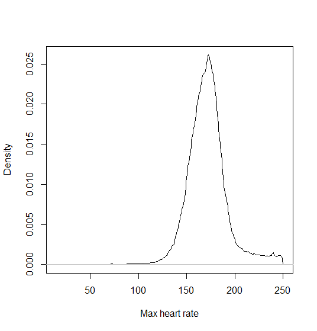
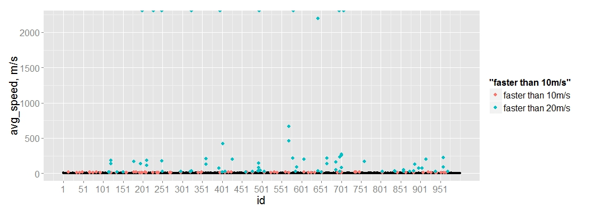
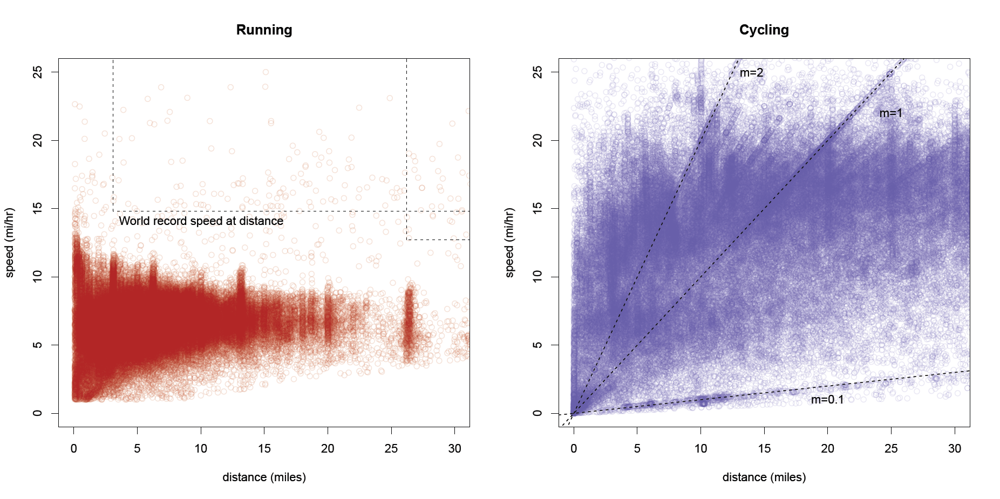
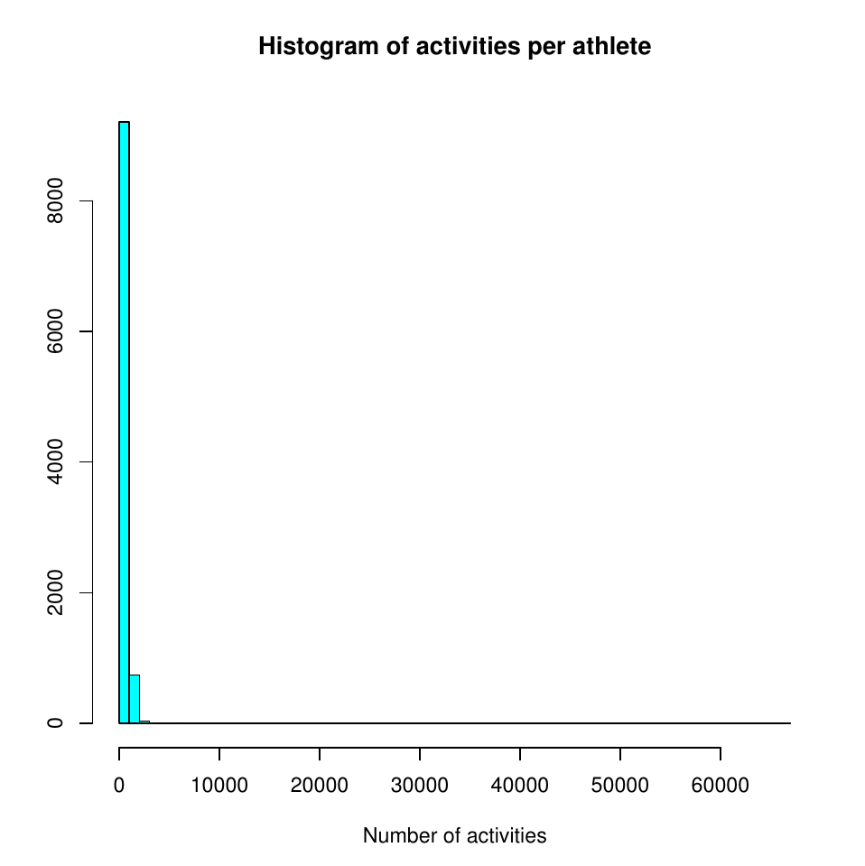
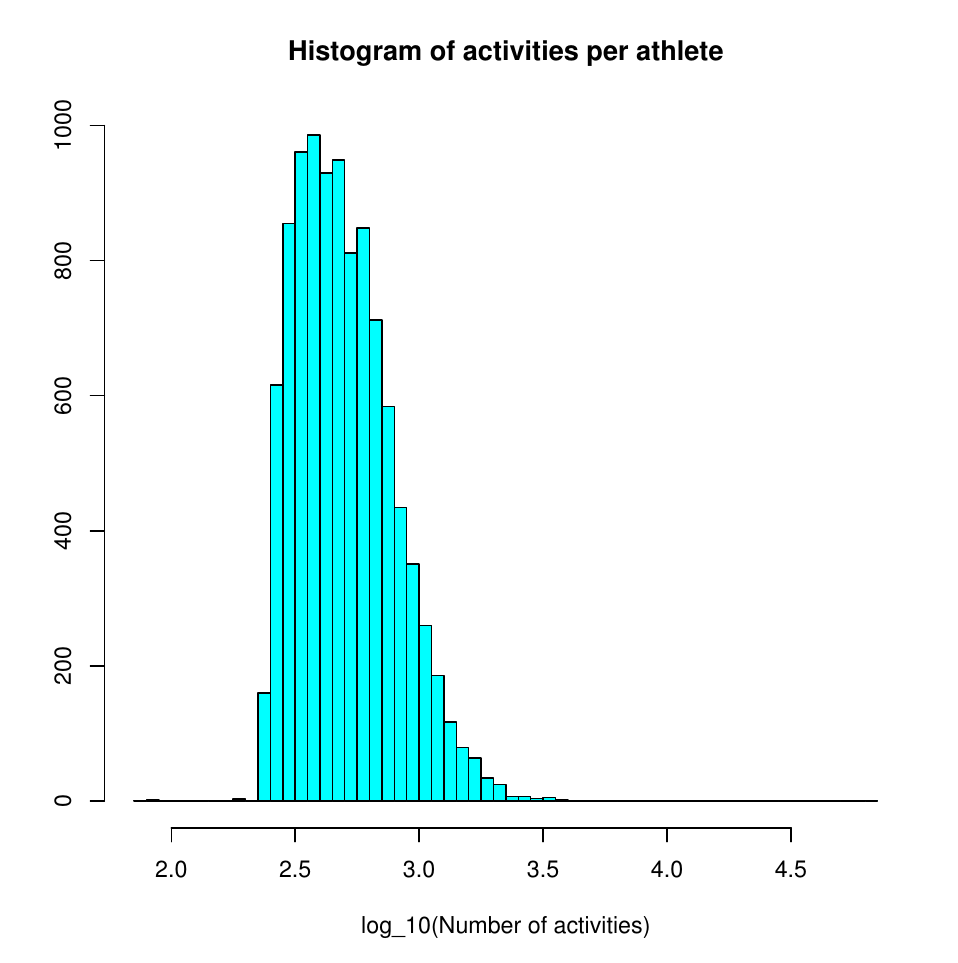
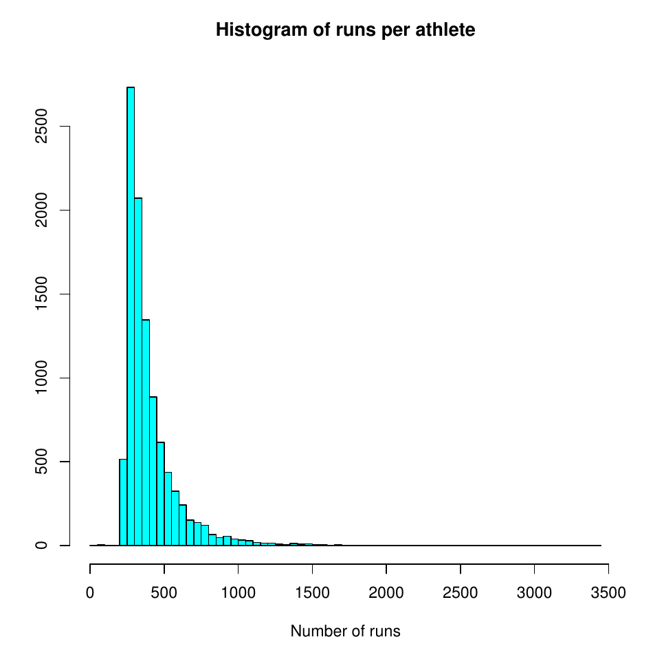
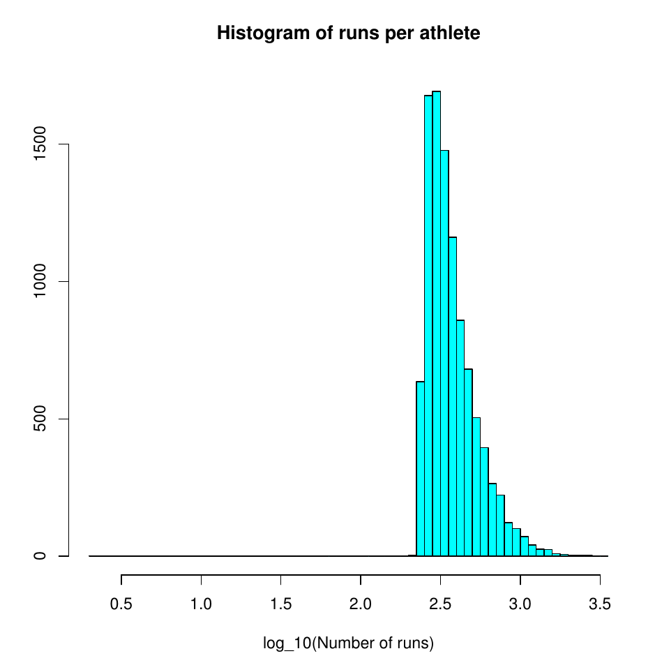

+ Course grading policy
+ Groups: please email us!

## Strava

+ Findings? Some plots from the groups:

+ Some plots about usage (Note: full 10k users, not 1k sample):

+ Data issues? Lots! e.g., (

		> # Extract number of duplicate activities per user:
		> n_dupes = unlist(lapply(ret,function(x){sum(duplicated(x[,-1]))}))
	 
		> # how many users with dupes:
		> sum(n_dupes > 0)
		[1] 63
	 
		> # only a few unique values:
		> table(n_dupes)
		n_dupes
		  0   1   2   3   4   5   6   9  21  36  44  53  83 
		937  36   6   8   3   2   1   2   1   1   1   1   1 

+ Next steps: 
  + More data: demographics, detailed run data, streams. 
  + Start targeting relationships of interest

## Cats and Dogs

+ Findings?
+ Feature extraction: physically motivated vs. automated
+ Next steps/status?

## Other projects?

+ Status updates next time
 

